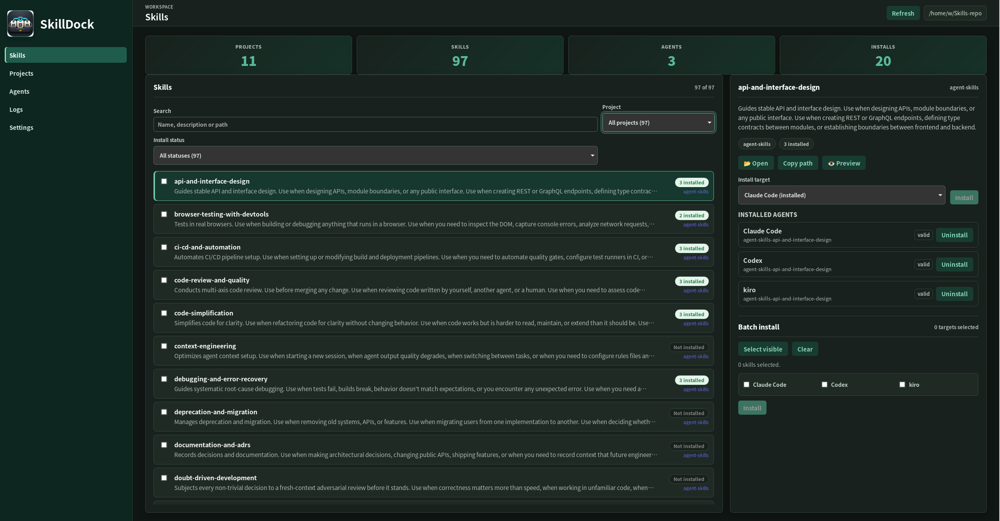

<div align="center">
  
  <h1>SkillDock</h1>
  <p><strong>Local-first Git workspace and symlink installer for AI agent skills</strong></p>
  <p><strong>English</strong> | <a href="README.zh-CN.md">简体中文</a></p>
  <p>
    
    
    
    
    
    
    
    
    
  </p>
</div>

---

SkillDock is a desktop manager for people who collect, write, and reuse **AI agent skills** across Claude Code, Codex, and custom coding agents.

Instead of copying `SKILL.md` folders into every agent, SkillDock keeps the source repositories in one local Git workspace and installs skills with **symlinks**. One source of truth, many agents, no duplicated skill folders.

## Why SkillDock?

- **Import skills from GitHub** — clone public, private, personal, or team skill repositories into one workspace.
- **Keep upstream history intact** — update source repositories with Git instead of losing track of copied files.
- **Install without duplication** — symlink skills into `~/.claude/skills`, `~/.codex/skills`, or any custom agent directory.
- **Audit what every agent uses** — see source repo, relative path, install target, conflicts, and current status before changing anything.
- **Manage local and remote collections together** — use the same workflow for popular open skill repos and your own private skill library.

SkillDock is not another cloud skill marketplace. It is a local-first control panel for the Git repositories you already trust.

## Common Use Cases

- Keep the same curated skills available in Claude Code, Codex, and a custom agent.
- Put your own skills in a private Git repo, then install them locally without copying folders.
- Try community skill repositories while keeping the source path, update path, and install target traceable.
- Sync the same SkillDock workspace structure across multiple machines through Git.

## Screenshot



Skills view: left-hand navigation, workspace stats at the top (Projects / Skills / Agents / Installs), a searchable and filterable skill list in the middle, and a right-hand detail panel for installing the selected skill — individually or in batch — into any configured agent.

## How It Works

```text
Git repos in one workspace
        |
        | scan SKILL.md folders
        v
SkillDock inventory
        |
        | create / remove safe symlinks
        v
Claude Code, Codex, or custom agent skill directories
```

Example layout:

```text
~/AgentSkills/
├── awesome-claude-skills/       # git clone
├── personal-agent-skills/       # your own Git repo
└── .skilldock/config.json       # workspace metadata

~/.claude/skills/code-review -> ~/AgentSkills/personal-agent-skills/code-review
~/.codex/skills/code-review  -> ~/AgentSkills/personal-agent-skills/code-review
```

## Core Capabilities

- **Workspace management** — pick and remember one collection root; scan top-level Git repos and `SKILL.md` files at startup.
- **Git import & update** — accept `owner/repo`, HTTPS, SSH, `git@...`, and arbitrary Git URLs; explicit "Check updates" runs `git pull --ff-only --prune` and skips dirty working trees by default.
- **Skill scanning & preview** — parse `SKILL.md` frontmatter, source project, relative path, assets / scripts / references markers, and current install status.
- **Agent profiles** — ship with Claude Code (`~/.claude/skills`) and Codex (`~/.codex/skills`) built-in; custom agents and one-click creation of missing target directories are supported.
- **Safe symlink install** — default link name `<repo>-<skill>` avoids collisions; single and batch installs always generate a conflict preview and never overwrite real files or real directories.
- **Safe uninstall** — removes only symlinks that point into the current workspace; external paths, real files, and source projects are never touched.
- **Serial task queue & logs** — Git, FS, and agent directories are shared resources, so tasks run serially by default; full stdout / stderr is visible in the Tasks / Logs view.

Deliberate **non-goals**: GitHub search / recommendation marketplace, skill editor, background daemon, real-time file watcher, deleting local project directories, branch switching, full Markdown renderer. See the design doc for details.

## Tech Stack

| Layer    | Choice                                              |
| -------- | --------------------------------------------------- |
| Shell    | [Tauri 2](https://tauri.app/)                       |
| Frontend | React 19 + TypeScript 6 + Vite 8                    |
| Backend  | Rust (Tauri commands)                               |
| Git      | Shells out to the system `git`, **not** via libgit2 |
| Testing  | Playwright (E2E) + `cargo test` (Rust)              |

## Requirements

- Linux or macOS
- Node.js ≥ 18 (nvm recommended)
- Rust stable toolchain (`rustup`)
- `git` on `PATH`
- Linux additionally needs WebKitGTK / GTK dependencies — follow the [Tauri prerequisites guide](https://tauri.app/start/prerequisites/).

## Quick Start

```bash
# Clone
git clone https://github.com/yiwen65/SkillDock.git
cd SkillDock

# Install frontend deps
npm install

# Start the desktop dev mode (Tauri + Vite)
npm run tauri:dev
```

The first run will compile the full Rust dependency graph (including native deps like `webkit2gtk-sys`) and takes several minutes. Subsequent incremental builds are fast.

Frontend-only dev (no Tauri shell):

```bash
npm run dev         # Vite dev server at http://127.0.0.1:1420
```

Release build:

```bash
npm run tauri:build # Artifacts land in src-tauri/target/release/bundle/
```

## Common Scripts

| Command               | Purpose                                    |
| --------------------- | ------------------------------------------ |
| `npm run dev`         | Vite only                                  |
| `npm run build`       | `tsc` + `vite build`                       |
| `npm run tauri:dev`   | Full desktop dev mode                      |
| `npm run tauri:build` | Build the desktop bundle                   |
| `npm run e2e`         | Playwright E2E tests                       |
| `npm run ui:smoke`    | UI smoke script (`scripts/ui-smoke.mjs`)   |
| `npm run rust:test`   | `cargo test` for the Rust backend          |

## Directory Layout

```text
SkillDock/
├── src/                    # React frontend
│   ├── App.tsx
│   ├── CoreView.tsx
│   ├── views/              # Skills / Projects / Agents / Tasks / Settings
│   └── lib/                # Tauri commands, types, shared helpers
├── src-tauri/              # Rust backend (Tauri)
│   ├── src/
│   │   ├── workspace.rs    # workspace scanning
│   │   ├── scanner.rs      # SKILL.md parsing
│   │   ├── git_ops.rs      # git fetch / pull / status
│   │   ├── links.rs        # symlink install / uninstall / preview
│   │   ├── agents.rs       # agent profile management
│   │   ├── tasks.rs        # serial task queue
│   │   └── config.rs       # workspace + user config
│   └── tests/              # backend integration tests
├── scripts/                # retained shell fallbacks and utilities
├── tests/e2e/              # Playwright E2E
├── docs/                   # design docs
│   ├── skilldock.md                     # design (product + architecture)
│   ├── skilldock-implementation-plan.md # implementation plan
│   ├── skilldock-tasks.md               # task breakdown
│   └── images/                          # README assets
└── public/                 # frontend static assets (app icon, etc.)
```

## Configuration Model

Two layers, detailed in the design doc:

- **Workspace config** — `<workspace>/.skilldock/config.json`: per-collection metadata such as tags, notes, favorites / hidden flags, and custom display names.
- **User app config** — the recent workspace list, agent profiles, UI preferences, check interval, etc.

Principle: **the filesystem and Git are the source of truth.** Config only stores user preferences and overrides; agent install status is always recomputed from symlinks in the agent directories.

## Safety Principles

- Never overwrite real files or directories
- Never delete project directories
- Never delete real files inside agent directories
- Skip dirty Git repos by default
- Always use `git pull --ff-only --prune` by default
- Never go online without an explicit user action
- Symlink sources must live inside the current workspace
- Every batch-mutating operation shows a preview first

## Documentation

- [Contributing guide](CONTRIBUTING.md) — branch workflow, required CI checks, release procedure
- [Security policy](SECURITY.md) — safety model and vulnerability reporting
- [GitHub discovery plan](docs/GITHUB_DISCOVERY.md) — description, topics, and launch copy for improving repository visibility
- [Release procedure](docs/RELEASING.md) — tagging, macOS codesign / notarize, Tauri updater signing
- [Product & architecture design](docs/skilldock.md) (Chinese)
- [Implementation plan](docs/skilldock-implementation-plan.md) (Chinese)
- [Task breakdown](docs/skilldock-tasks.md) (Chinese)
- [AGENTS collaboration conventions](AGENTS.md)

## Status

MVP in progress. See [docs/skilldock-tasks.md](docs/skilldock-tasks.md) for the active task list. Issues and PRs are welcome.

## License

SkillDock is released under the [PolyForm Noncommercial License 1.0.0](LICENSE.md). In short:

- **Permitted**: personal use, research, study, hobby projects, and any other noncommercial purpose.
- **Permitted**: use by charities, schools, universities, public research / health / safety / environmental / government bodies.
- **Not permitted**: any commercial use. If you want to use SkillDock commercially, please open an issue or contact the authors for a separate commercial arrangement.

This license is **source-available, not open source** (it intentionally restricts commercial use, which the OSI Open Source Definition does not allow). See the full license text in [`LICENSE.md`](LICENSE.md).
